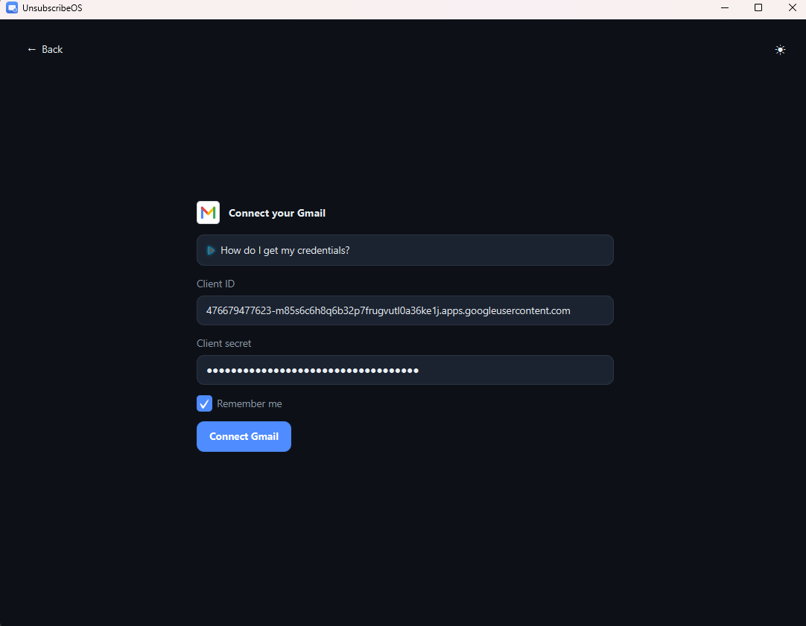
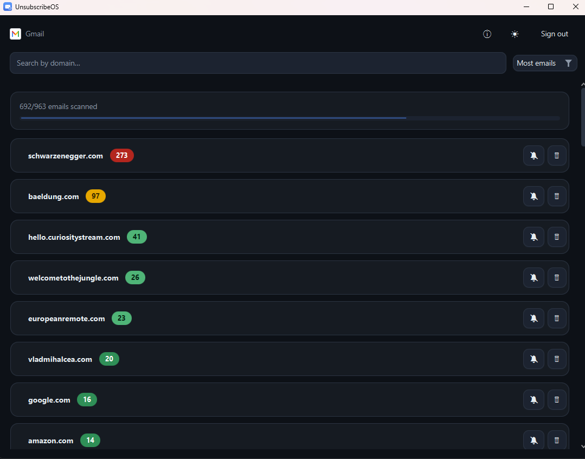

<div align="center">


# UnsubscribeOS

**A calm, free, open-source desktop app to clean up your inbox — unsubscribe from and delete bulk senders, grouped by domain.**

Gmail &amp; Outlook (for now) · 100% local · JavaFX · JDK 25

</div>

---

## What is it?

UnsubscribeOS connects directly to your **Gmail** or **Outlook** mailbox from your own computer, finds the bulk/marketing senders cluttering your inbox, and groups them **by domain** so you can see who emails you the most — and **unsubscribe** from or **delete** them in a couple of clicks.

It is deliberately a **desktop** application, not a web service: your credentials and email **never leave your machine**. There is no server, no account, no telemetry.

### Why another unsubscriber?

- **Privacy-first.** Everything runs locally. The app talks only to Google/Microsoft, directly, using OAuth credentials *you* create. Tokens are stored encrypted on disk.
- **Safe by design.** Only automated/bulk senders (newsletters, notifications, receipts) are shown — detected via standard list/automation headers — so personal mail you wrote or received stays out of reach of the bulk-delete button. Deletions go to **Trash** (recoverable), not permanent deletion.
- **Calm & focused.** A single, quiet dashboard: senders ranked by volume, colour-graded by how much they email you.

---

## Features

- 📮 **Gmail & Outlook** support out of the box, built for easy extension to more providers.
- 🗂️ **Grouped by domain**, busiest senders first, with a **heat colour** (red → green) showing relative volume.
- 🔎 **Live search** by domain and **sort** (Most emails / Name A–Z / Name Z–A).
- 🎚️ **Adjustable scan depth** — choose how many of your newest emails to scan from a toolbar dropdown (default 5,000); the choice is remembered and re-scans on the spot.
- ⏱️ **Live fetching** with an `x / y` progress bar, then **auto-refresh every 5 seconds** (only new messages are fetched).
- 🔕 **Unsubscribe** per sender — uses the email's official **RFC 8058 one-click** link silently when available, otherwise opens the unsubscribe page or a pre-filled email.
- 🗑️ **Delete** all mail from a sender, or individual messages — moved to **Trash / Deleted Items** (recoverable).
- 🌓 **Dark & light** themes, responsive layout, toast notifications, and an in-app About dialog.
- 🔐 **Encrypted local storage** (AES-256-GCM) for tokens and (optional) remembered credentials. Stay signed in across launches; "Remember me" pre-fills credentials after sign-out.

---

## Screenshots

| Provider screen | Dashboard |
|---|---|
|  |  |

---

## Download & install

> **For everyday users — no Java or setup required.**

Grab the installer for your system from the [**Releases**](../../releases) page, then double-click:

| OS | File | Notes |
|---|---|---|
| **Windows** | `UnsubscribeOS-x.y.z.msi` | Double-click → Next → Finish. Adds a Start-menu shortcut. |
| **macOS** | `UnsubscribeOS-x.y.z.dmg` | Open, drag the app to Applications. |
| **Linux** | `unsubscribeos_x.y.z_amd64.deb` | `sudo apt install ./unsubscribeos_*.deb` (or double-click). |

Each installer bundles its own Java runtime, so there is nothing else to install. After launching, follow the in-app guide to connect your Gmail/Outlook account (see [Provider setup](#provider-setup)).

> **First-launch security prompts:** because the installers aren't code-signed, Windows SmartScreen ("More info → Run anyway") or macOS Gatekeeper ("right-click → Open") may warn on first run. Signing/notarisation removes this but requires a paid certificate — see [Building installers](#building-installers).

---

## Tech stack

| Concern | Choice |
|---|---|
| Language | **Java 25** (records, virtual threads, switch expressions, text blocks) |
| UI | **JavaFX 25** (controls, CSS theming) |
| Build | **Maven** |
| JSON | **Jackson** |
| Tests | **JUnit 5** |
| HTTP | JDK `java.net.http.HttpClient` |
| Crypto | JDK `javax.crypto` (AES-256-GCM) |

No Spring, no heavyweight frameworks — just a small, layered codebase.

---

## Getting started

### Prerequisites

- **JDK 25** (`java -version` should report 25).
- **Maven 3.9+**.
- An OAuth client you create for free in Google Cloud / Microsoft Entra (the app guides you — see [Provider setup](#provider-setup)).

### Run from source (development)

```bash
mvn javafx:run
```

### Run the tests

```bash
mvn test
```

### Build a runnable jar

```bash
mvn clean package
java -jar target/unsubscribeos-1.0.0.jar
```

`maven-shade-plugin` produces a self-contained "fat" jar; the entry point is `com.unsubscribeos.Main` (a plain launcher that delegates to the JavaFX `Launcher`, so `java -jar` works without module-path flags).

> **Cross-building note (important for JavaFX):** the bundled JavaFX **native libraries are platform-specific**. A jar built on Linux runs on Linux; to build a Windows jar, pass the platform:
> ```bash
> mvn -Djavafx.platform=win clean package   # bundles Windows .dll natives
> ```
> Use `mac`/`linux` likewise. (Handy when developing in WSL but running on Windows.)

### Building installers

Native installers are produced with **`jpackage`** (bundled with the JDK), which wraps the app **and a Java runtime** so end users install nothing else. `jpackage` is **platform-bound** — each OS's installer must be built on that OS.

Ready-made scripts live in [`packaging/`](packaging/):

```bash
# on Windows  (needs JDK 25 + WiX Toolset v3 on PATH)
packaging\package-windows.bat      ->  dist\UnsubscribeOS-1.0.0.msi

# on macOS    (needs JDK 25; build per architecture)
bash packaging/package-macos.sh    ->  dist/UnsubscribeOS-1.0.0.dmg

# on Linux    (needs JDK 25 + dpkg)
bash packaging/package-linux.sh    ->  dist/unsubscribeos_1.0.0_amd64.deb
```

Each script builds the platform-specific fat jar, stages it, and runs `jpackage` with the app icon (`packaging/windows/icon.ico`, `packaging/linux/icon.png`; generate `packaging/macos/icon.icns` on a Mac).

**Build all three automatically.** The [`.github/workflows/release.yml`](.github/workflows/release.yml) GitHub Actions workflow builds Windows/macOS/Linux installers on their native runners and attaches them to a GitHub Release. Tag a version to trigger it:

```bash
git tag v1.0.0 && git push --tags
```

**Code signing (optional).** Unsigned installers trigger first-run warnings (Windows SmartScreen, macOS Gatekeeper). To remove them you need a Windows Authenticode certificate and/or Apple Developer ID notarisation (both paid); wire the signing step into the scripts/workflow once you have a certificate.

---

## Provider setup

UnsubscribeOS signs in with **your own** OAuth client, so nothing is hard-coded and your data goes only to you. The in-app **"How do I get my credentials?"** panel has step-by-step instructions; in short:

**Gmail**
1. In [Google Cloud Console](https://console.cloud.google.com/), create a project.
2. Enable the **Gmail API**.
3. Configure the **OAuth consent screen** (External; add yourself as a Test user).
4. Create an **OAuth client ID** → application type **Desktop app**.
5. Paste the **Client ID** and **Client secret** into the app.
   - Scope used: `https://www.googleapis.com/auth/gmail.modify` (read + move-to-trash; never permanent delete).

**Outlook / Microsoft**
1. In [Microsoft Entra](https://entra.microsoft.com/) → **App registrations** → **New registration**.
2. Account type: personal (and/or org) accounts.
3. Add a **Mobile & desktop** redirect URI of `http://localhost`.
4. Add Microsoft Graph **delegated** permissions: `Mail.ReadWrite`, `offline_access`.
5. Paste the **Client ID** into the app (no secret needed for desktop).

Sign-in uses the **OAuth 2.0 Authorization Code flow with PKCE** and a temporary **loopback redirect** (`http://localhost:<random-port>`) — the industry-standard pattern for native apps.

---

## How it works

### Architecture at a glance

The codebase is split into a UI-agnostic **core** and a thin **JavaFX UI**. The UI depends on the core through small interfaces and services; the core never depends on JavaFX.

[](docs/architecture.puml)

<sub>Rendered from [`docs/architecture.puml`](docs/architecture.puml) via the PlantUML server.</sub>

### Layers & packages

| Package | Responsibility |
|---|---|
| `com.unsubscribeos` | `Main` (jar entry point) and `Launcher` (JavaFX `Application`; wires the service graph). |
| `config` | `ProviderConfigs` (OAuth endpoints/scopes + help text), `AppPaths` (per-user data dir), `Settings` (theme + scan-depth prefs). |
| `core.model` | Immutable **records**: `Provider`, `Account`, `Credentials`, `TokenSet`, `OAuthConfig`, `EmailMessage`, `MailDomain`, `UnsubscribeInfo`, `FetchProgress`. |
| `core.auth` | `AuthService` (sign-in/refresh/sign-out), `AccountStore` interface + `EncryptedAccountStore`, `Aes`, `Pkce`, `LoopbackOAuth`. |
| `core.http` | Thin `HttpClient` wrapper (`Http`, `Json`, `HttpException`). |
| `core.mail` | `MailService` interface, `AbstractMailService` (Template Method base), `MailServiceFactory`, `gmail/`, `outlook/`, plus helpers: `ConcurrentFetcher`, `DomainAggregator`, `UnsubscribeHeaders`, `BulkMail`, `Addresses`, `Chunks`, `FetchContext`. |
| `core.unsubscribe` | `UnsubscribeService` (ordered Strategy: one-click → page → mailto) + `UnsubscribeResult`. |
| `core.platform` | `Browser` (cross-platform URL/mailto launcher, incl. WSL). |
| `ui` | `Router`, `AppContext` (DI record), `ThemeManager`, `Theme`, `Async` (off-UI-thread helper), `Errors` (throwable → message). |
| `ui.view` | Onboarding screens: `ProviderView`, `CredentialsView`. |
| `ui.view.dashboard` | The dashboard feature: `DashboardView`, `DomainGrid`, `DomainCard`, `DomainSort`. |
| `ui.component` | Reusable widgets: `Ui`, `Toast`/`Notifier`, `Modal`, `Tutorial`, `ProviderLogo`, `AppIcon`, `ThemeToggle`, `HeatScale`. |

### Design principles & patterns

The code leans on a handful of patterns where they remove real duplication — not for their own sake:

- **Factory** — `MailServiceFactory` resolves the right `MailService` per provider.
- **Template Method** — `AbstractMailService` holds the shared *list → fetch concurrently → delete in batches* skeleton; `GmailService`/`OutlookService` fill in only the provider specifics.
- **Strategy** — `UnsubscribeService` tries an ordered list of methods (one-click → page → mailto); `DomainSort` swaps comparators for the sort control.
- **Observer** — JavaFX properties (e.g. `ThemeManager`) notify the UI of changes.
- **Dependency Injection** — `AppContext` (a record) passes shared services to views; nothing reaches for globals.
- **Facade** — `Http` over `HttpClient`, `Browser` over OS launchers; `Notifier` hides how feedback is shown (`Toast`).

Plus: **SOLID & small units** (adding a provider = one impl + one factory entry + one config entry), **immutability** (domain data are records), **functional style** (streams, small composable methods), and **concurrency** (blocking I/O on **virtual threads**, results marshalled back via `Async`/`Platform.runLater`, per-message fetches bounded by a semaphore).

---

### Key flows

#### 1. Startup & stay-signed-in

[](docs/flow-startup.puml)

#### 2. Sign-in (OAuth + PKCE, loopback)

[](docs/flow-signin.puml)

#### 3. Fetch, group & live-poll

[](docs/flow-fetch.puml)

**Mail scope.** The scan reads your received mail newest-first — Gmail via `q = -in:sent -in:chats`, Outlook via Graph `$orderby=receivedDateTime desc` — and **keeps only automated / bulk senders**: those whose messages carry a standard list or automation header (`List-Unsubscribe`, `List-Id`, `List-Post`, `Precedence: bulk/list`, `Auto-Submitted`). Personal mail — what you wrote, and the replies people send back — has none of these, so it never appears or becomes deletable; this also catches bulk senders regardless of language or which inbox tab they land in. Senders exposing `List-Unsubscribe` get an **unsubscribe** button; the rest are **delete-only**. How many of the newest messages are scanned is **configurable** (toolbar dropdown, default 5,000, persisted as `scan.depth`); to stay responsive the 5-second poll only re-lists the newest few hundred to pick up new arrivals.

#### 4. Unsubscribe

`UnsubscribeService` reads the parsed `List-Unsubscribe` / `List-Unsubscribe-Post` headers and picks the safest path:

1. **RFC 8058 one-click** → a silent HTTPS `POST` (no browser).
2. Otherwise → open the unsubscribe **web page**.
3. Otherwise → open a pre-filled **mailto:** draft.
4. Otherwise → report that the sender offers no unsubscribe method.

The outcome is surfaced as a colour-coded **toast**.

#### 5. Delete

Per-sender or per-message deletes move mail to **Trash** (Gmail `batchModify` adding the `TRASH` label) / **Deleted Items** (Graph `$batch` `DELETE`). Both are **recoverable**. Deleted IDs are purged from the local buffer so the next poll stays consistent.

---

## Security & privacy

- **Local only.** The app communicates solely with Google/Microsoft APIs from your machine. No backend, no analytics.
- **Your own OAuth client.** You create the credentials; you control scopes and revocation.
- **PKCE + loopback** authorization — no secrets in URLs, no embedded webview.
- **Encryption at rest.** Tokens and remembered credentials are stored **AES-256-GCM** encrypted under a per-install master key, with owner-only file permissions (`0600`/`0700` on POSIX).
- **Recoverable deletes.** Nothing is permanently deleted — messages go to Trash/Deleted Items.
- **Threat model.** Single-user desktop: a local attacker already running as your user is considered trusted (matching how desktop apps generally work).

### Where data is stored

Per-user config directory (`$XDG_CONFIG_HOME/unsubscribeos` or `~/.config/unsubscribeos`; override with `-Dunsubscribeos.home=...`):

| File | Contents |
|---|---|
| `master.key` | Per-install AES key (base64). |
| `tokens-<provider>.enc` | Encrypted session account (tokens + client creds). Removed on sign-out. |
| `creds-<provider>.enc` | Encrypted remembered credentials (only if "Remember me"). |
| `settings.properties` | Non-secret prefs (theme, `scan.depth`). |

---

## Extending: add a new provider

The provider boundary is intentionally small. To add, say, Yahoo:

1. Add a value to `core.model.Provider` (display name + glyph).
2. Extend `core.mail.AbstractMailService` — supply only `listMessageIds`, `fetchMessage`, `deleteBatch`, and `batchLimit` (the fetch/delete skeleton is inherited).
3. Register it in `core.mail.MailServiceFactory`.
4. Add OAuth endpoints/scopes + help text in `config.ProviderConfigs`.

No UI changes required — the provider screen, fetch loop, grouping, unsubscribe and delete all work through the interface.

---

## Project layout

```
src/main/java/com/unsubscribeos/
├── Main.java · Launcher.java          # entry points
├── config/                            # ProviderConfigs, AppPaths, Settings
├── core/
│   ├── model/                         # records: Account, EmailMessage, MailDomain, …
│   ├── auth/                          # AuthService, *AccountStore, Aes, Pkce, LoopbackOAuth
│   ├── http/                          # Http, Json, HttpException
│   ├── mail/                          # MailService, AbstractMailService (+gmail/outlook), ConcurrentFetcher, DomainAggregator …
│   ├── unsubscribe/                   # UnsubscribeService, UnsubscribeResult
│   └── platform/                      # Browser
└── ui/
    ├── Router · AppContext · ThemeManager · Theme · Async · Errors
    ├── view/                          # ProviderView, CredentialsView
    │   └── dashboard/                 # DashboardView, DomainGrid, DomainCard, DomainSort
    └── component/                     # Ui, Toast, Modal, Tutorial, ProviderLogo, AppIcon, ThemeToggle, HeatScale
src/main/resources/
├── css/                               # app.css + theme-dark.css + theme-light.css
└── icon.svg · icon.png
src/test/java/…                        # JUnit 5 tests for the pure logic
```

---

## Testing

Unit tests cover the deterministic core logic (grouping, sorting, heat scaling, progress maths, unsubscribe-header parsing, URL extraction):

```bash
mvn test
```

UI screens are thin and delegate to tested core/services; OAuth and live API calls are not unit-tested (they require a real account).

---

## Roadmap ideas

- Delta/incremental sync (Gmail History API, Graph delta) instead of re-listing on each poll.
- `jpackage` installers (`.msi` / `.dmg` / `.deb`) with a bundled runtime and the app icon.
- More providers (Yahoo, IMAP).
- Detect unsubscribe links in the message **body** for senders that don't send a `List-Unsubscribe` header.

---

## Contributing

Issues and pull requests are welcome. Please keep the style of the codebase: small classes, records for data, functional/stream-based logic, and tests for new core logic. Run `mvn test` before submitting.

---
<div align="center">
Made for calmer inboxes. 📭
</div>
